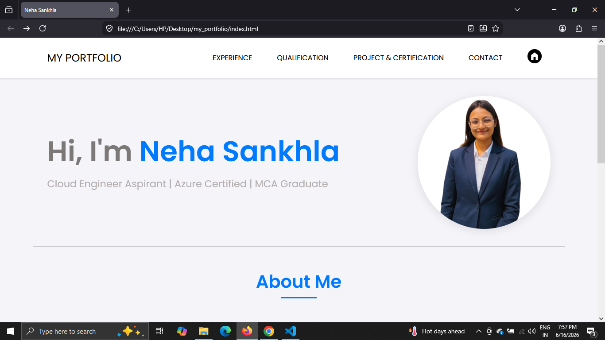
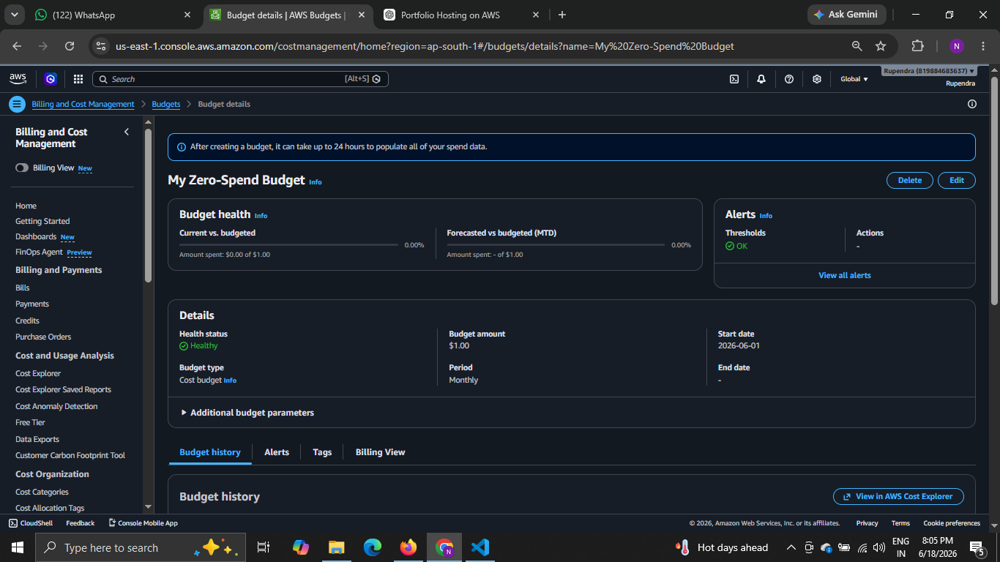
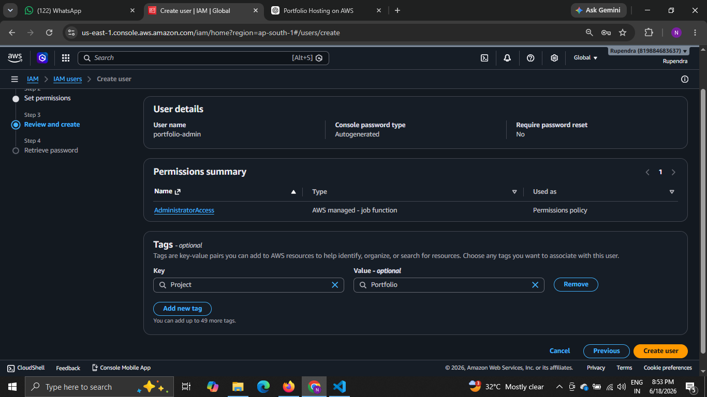
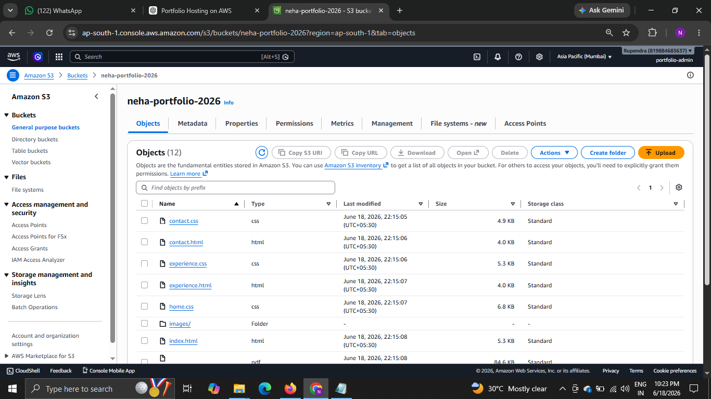
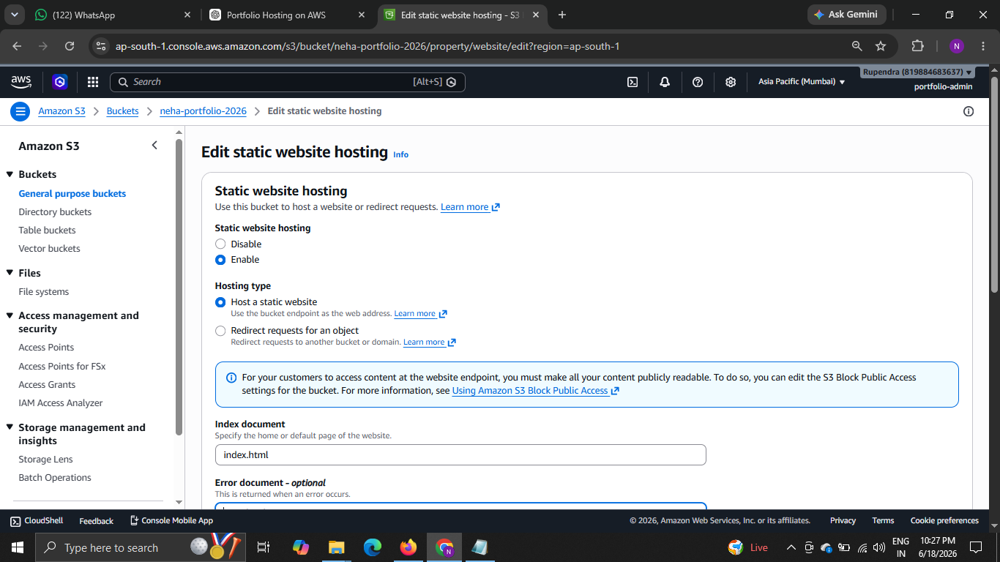
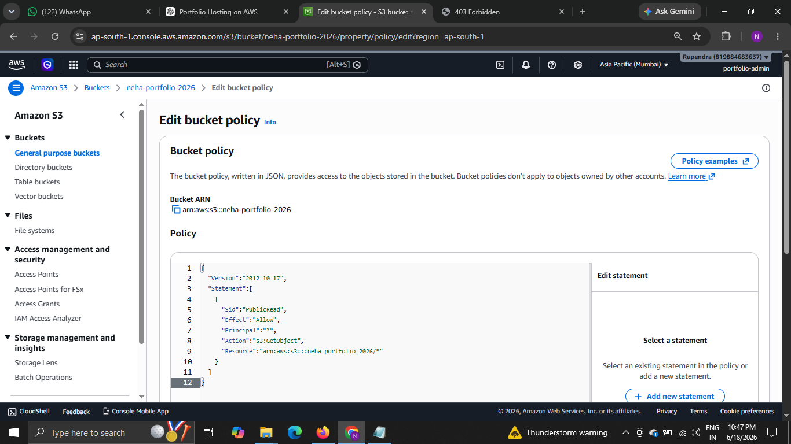
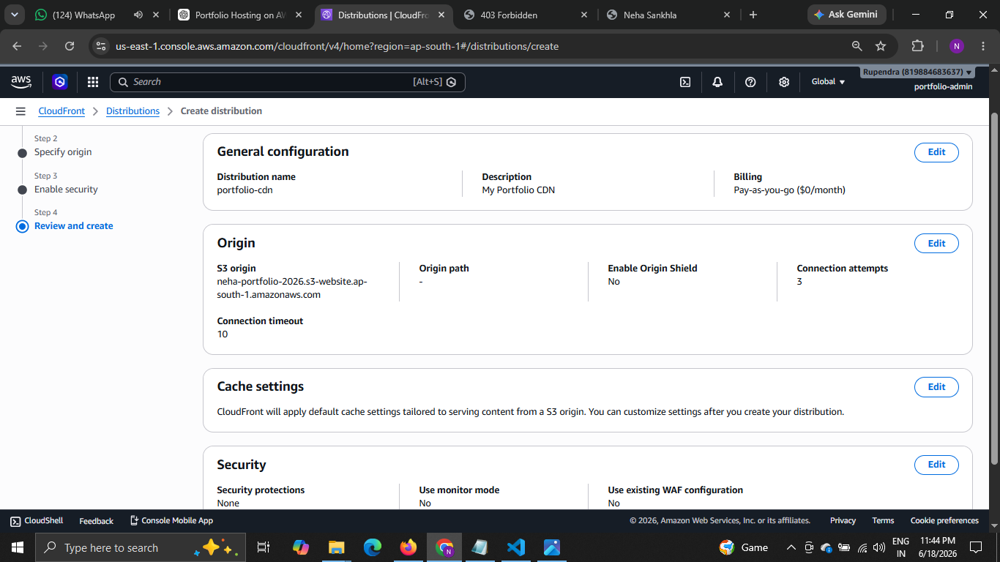
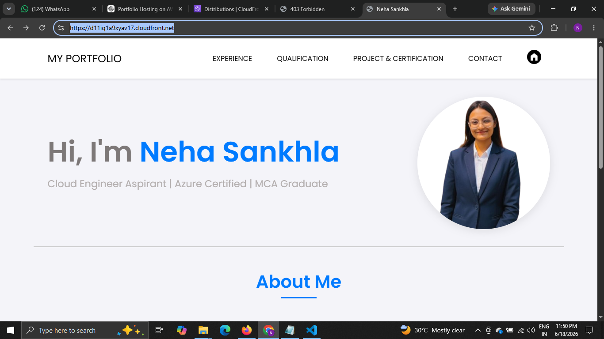

🚀 Personal Portfolio Website with AWS S3 & CloudFront Hosting

# 📖 Project Overview

This project showcases the design, development, and deployment of my personal portfolio website.
The portfolio was **designed and developed from scratch** using **HTML, CSS, and JavaScript** to present my skills, projects, certifications, and contact information.
After completing the frontend development, the website was deployed as a static website using **Amazon S3** and delivered globally using **Amazon CloudFront** for improved performance and faster content delivery.
To follow AWS security best practices, all cloud resources were created and managed using an **IAM User** instead of the AWS root account.

# 🎯 Project Objectives

- Design and develop a responsive portfolio website.
- Practice frontend development using HTML, CSS, and JavaScript.
- Deploy a static website using Amazon S3.
- Improve website performance using Amazon CloudFront.
- Follow AWS security best practices using IAM.
- Understand static website hosting on AWS.

# 🏗️ Project Architecture

Portfolio Development
(HTML + CSS + JavaScript)
            │
            ▼
      Local Machine
            │
            ▼
      Amazon S3 Bucket
            │
            ▼
 CloudFront Distribution
            │
            ▼
   Live Portfolio Website

# 🛠️ Technologies Used

## Frontend

- HTML5
- CSS3
- JavaScript

## Cloud Services

- Amazon S3
- Amazon CloudFront
- AWS IAM
- AWS Budgets

# ✨ Features

- Responsive Portfolio Website
- Developed from Scratch
- Static Website Hosting
- CloudFront CDN Integration
- Secure IAM User Access
- AWS Budget Configuration
- Fast Global Content Delivery

# 📂 Project Structure

Portfolio/
│
├── index.html
├── style.css
├── script.js
├── images/
├── assets/
└── README.md

# ⚙️ Project Workflow

## Step 1

Designed and developed the portfolio website using **HTML, CSS, and JavaScript**.

## Step 2

Configured an **AWS Budget** to monitor cloud costs and avoid unexpected charges.

## Step 3

Created an **IAM User** and used it instead of the root account for enhanced security.

## Step 4

Created an **Amazon S3 Bucket** for hosting the static website.

## Step 5

Enabled **Static Website Hosting** and uploaded all portfolio files.

## Step 6

Configured the **Bucket Policy** to allow public access for website hosting.

## Step 7

Created an **Amazon CloudFront Distribution** and connected it with the S3 bucket.

## Step 8

Verified the website deployment through the CloudFront URL.

# 📸 Project Screenshots

## Portfolio Website

## AWS Budget

## IAM User

## Amazon S3 Bucket

## Static Website Hosting

## Bucket Policy

## CloudFront Distribution

## Live Portfolio Website

# 🌐 Deployment Flow

HTML + CSS + JavaScript
           │
           ▼
      Local Machine
           │
           ▼
     Amazon S3 Bucket
           │
           ▼
CloudFront Distribution
           │
           ▼
  Live Portfolio Website

# 🔒 AWS Services Used

| AWS Service | Purpose |
|-------------|----------|
| AWS Budgets | Monitor AWS spending |
| IAM | Secure access management |
| Amazon S3 | Static website hosting |
| Amazon CloudFront | Global content delivery |

# 📚 Key Learnings

- Developed a responsive portfolio website using HTML, CSS, and JavaScript.
- Learned Amazon S3 Static Website Hosting.
- Configured AWS IAM Users and Permissions.
- Connected CloudFront with Amazon S3.
- Understood CDN (Content Delivery Network) concepts.
- Learned AWS security best practices.
- Managed cloud resources using IAM instead of the root account.

# 🐞 Challenges Faced

- Configuring Static Website Hosting.
- Understanding Bucket Policies.
- Connecting CloudFront with Amazon S3.
- Managing IAM permissions.
- Waiting for CloudFront distribution deployment.

# 🔮 Future Improvements

- Add a Custom Domain.
- Enable HTTPS using AWS Certificate Manager (ACM).
- Automate deployment using GitHub Actions (CI/CD).
- Provision infrastructure using Terraform.
- Containerize the application using Docker.

# 👩‍💻 Author

**Neha Sankhla**

MCA Student | Aspiring Cloud & DevOps Engineer

